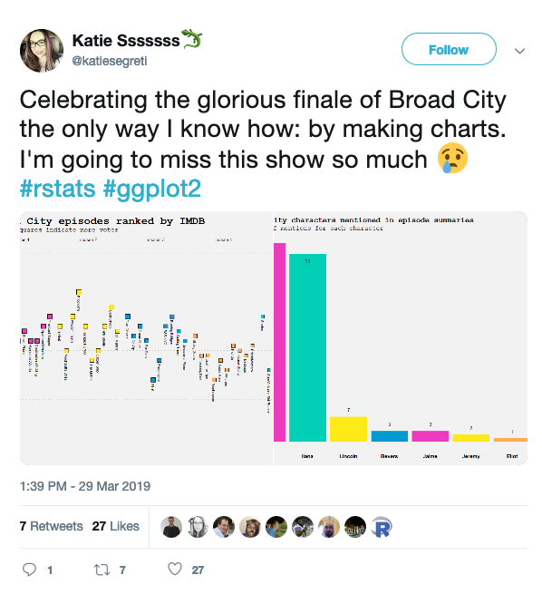
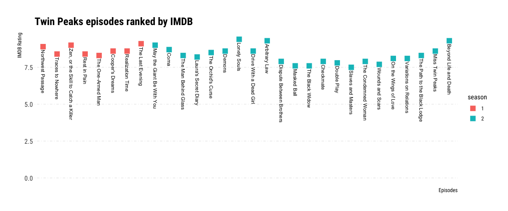
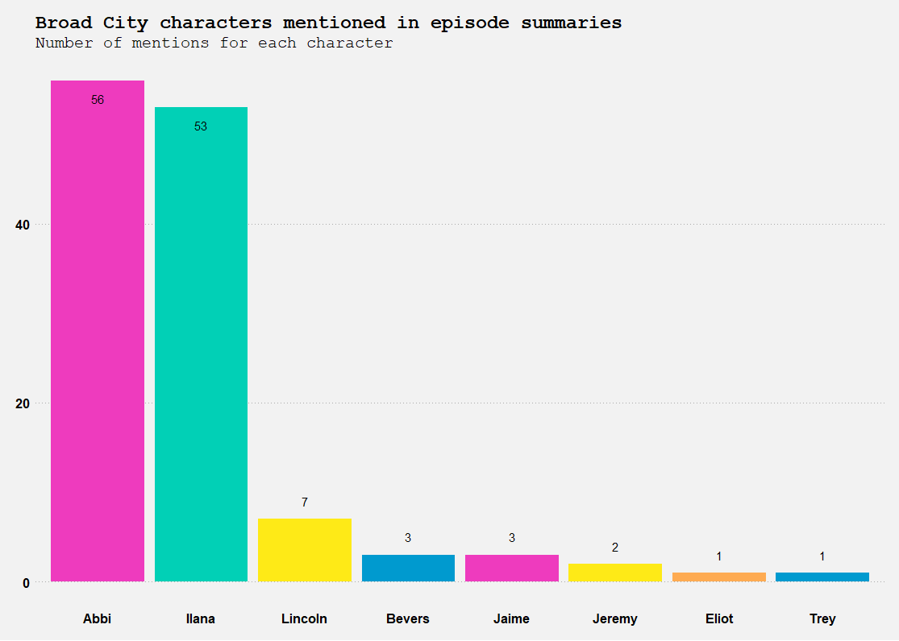

I’ve been *using* data for several years. First as a supply chain
analyst, compiling pricing data in MS Excel for solar panels in the US,
and later as a web developer, engineering user-interfaces that produce
data (think: forms, etc.).

But when I was an analyst, my data lacked depth. Mostly, I was compiling
pivot-tables in MS Excel of price quotes that I had sourced directly
from my own suppliers. Occasionally I would get access to some industry
publication data that I could mix-in, but I didn’t know how to go-out
and get more of my own data, and even if I knew where to look for it, I
wouldn’t have known how to extract it and use it.

As a web developer, I became good at creating content management systems
that over-time would collect plenty of data. Articles, user-comments,
likes, page-views, —all of these are valuable sources of data that can
tell a story about a publication and it’s customers. But even though I
could create the system itself, I was at a loss when I needed to
investigate how people were using the application that I built.

For example; I knew how to query the publication’s database, and I could
run basic analysis on its tables using SQL, or importing a dump of the
database into Excel to do some analysis of it there. But if someone were
to ask me how to integrate the product data to revenue data from our
accounting software, and to combine those with customer data from
Salesforce —I wouldn’t have known where to begin.

Thankfully, one thing that I’ve learned since university is that new
technical skills aren’t hard to learn, given enough time and motivation.
Since I have the good fortune to work for an online education provider,
I decided to start following the Extension School course titled [“50
Things You Need to Know About
Data”](https://exts.epfl.ch/courses-programs/50-things-you-need-to-know-about-data).
This course starts-off comfortably, exploring conventional ways of
visualizing and storing data using spreadsheets, but it isn’t long
before it introduces R, a programming language designed for working with
data.

After two weeks of using R to manipulate the example data from the
course (sales reporting data, and real-world AirBnb listings for the
state of Texas), my colleague Xavier, the creator of the course,
challenged me to use what I learned to study the popularity of my
favorite TV show, Twin Peaks. Here’s how the conversation went:


Twin Peaks, for those of you who don’t know, is an all-time classic that
originally aired from 1989 until 1991. Most critics see Twin Peaks as a
show that was ahead of it’s time; pioneering a genre that would later
bring viewers Breaking Bad, Stranger Things, another other modern
favorites.

In [the
tweet](https://twitter.com/katiesegreti/status/1111729535266013184), the
author shares two charts that she made about a show that she watches,
Broad City. The first chart describes the popularity of the show through
Internet Movie Database ratings for each episode, and the second
features the number of episodes that each character appeared-in
throughout the show’s five seasons.



But I didn’t know where I would get the data from to make a similar
chart about Twin Peaks. You see; Twin Peaks isn’t the monthly
publication from the Bureau of Labor Statistics that details how many
new jobs were added to the economy. It’s an obscure-enough subject that
there isn’t a tidy package of published data about the show that I could
download, or an API from which I could request it.

A close-up of the first chart shows us the IMDB rating for each episode,
so at the very least, we would need to get the title of each episode,
and it’s rating from IMDB. I inferred that the author probably “scraped”
the data from IMDB’s website.


Already, I noticed one major hurdle that I would have to overcome if I
wanted to reproduce her chart with the Twin Peaks data. IMDB doesn’t
actually use the descriptive titles for each episode of Twin Peaks, as
it does for Broad City. Have a look at the screenshot below. You’ll
notice that IMDB simply numbers each episode of Twin Peaks.


This challenge wasn’t going to be easy, but I learned in the course how
to scrape data from one source, and to put it in a table where I could
use it to plot a chart. It wouldn’t be too much of a stretch to use what
I had learned to compile scraped data from multiple sources into a
single table that I could use to produce the chart.

I knew that there was another source that I could use to get the episode
titles. A fan wiki for the show, maintained by who knows who, containing
the title, and the characters, writers, and director for each episode as
well. Here’s what the page for episode 2.2 (season 2, episode 2) looks
like on the Twin Peaks Wiki.


R gives us a few handy functions for scraping information from web
pages, so it didn’t take very much code to get the job done. The varible
below, `url_base` represents where we’ll scrape the data from, and below
it are the CSS selectors that we’ll use to find each particular node of
information on the page.

``` r
url_base <- "https://twinpeaks.fandom.com/wiki/"
```

Here’s what we’ll scrape from the wiki: the title, date, season, and the
writer, director, composer, and cast credits for each episode. You can
see some of these values in the screenshot above (look at the top of the
image, and in the side-bar too).

``` r
css_selectors <- list(
  title = "aside .pi-data-value[data-source='German']",
  writer = "aside .pi-data[data-source='Writer'] .pi-data-value a",
  director = "aside .pi-data[data-source='Director'] .pi-data-value",
  composer = "aside .pi-data[data-source='Music'] .pi-data-value",
  season = "aside .pi-data-value[data-source='Season']",
  date = "aside .pi-data[data-source='Airdate'] .pi-data-value",
  cast = ".WikiaArticle > div > ul > li"
)
```

The code below shows how the just a few functions (`read_html`,
`html_text`, and `html_nodes`) can be used to extract the information we
need from
[twinpeaks.fandom.com/wiki/Pilot](https://twinpeaks.fandom.com/wiki/Pilot)
and store it in a list.

``` r
pilot_data <- read_html(str_c(url_base, "Pilot", .sep = "")) %>%
  {list(
    title = str_remove(html_text(html_nodes(., css_selectors$title)), "or: "),
    writer = html_text(html_nodes(., css_selectors$writer)),
    director = html_text(html_nodes(., css_selectors$director)),
    composer = html_text(html_nodes(., css_selectors$composer)),
    season = html_text(html_nodes(., css_selectors$season)),
    date = html_text(html_nodes(., css_selectors$date)),
    cast = html_text(html_nodes(., css_selectors$cast))
  )}
```

The URL for the rest of the episodes follows a slightly different
pattern from the pilot episode. If the paths were the same, we could
have done all of our scraping in a single step, but because the
subseqent episodes are found at
*twinpeaks.fandom.com/wiki/Episode\_\[episode number\]* (ex.
[twinpeaks.fandom.com/wiki/Episode\_3](https://twinpeaks.fandom.com/wiki/Episode_3)),
the code below loops through episodes 2-30, scraping the same
information as was scraped about the pilot, and it returns a single list
of all episode data from the pilot through episode \#30 —better known as
“Beyond Life and Death”.

``` r
all_episodes <- list(pilot_data) %>%
  append(map(1:29, function(i) {
    episode_path <- str_c(url_base, "Episode_", i, .sep = "")
    current_page <- read_html(episode_path)
    list(
      title = str_remove(html_text(html_nodes(current_page, css_selectors$title)), "or: "),
      writer = html_text(html_nodes(current_page, css_selectors$writer)),
      director = html_text(html_nodes(current_page, css_selectors$director)),
      composer = html_text(html_nodes(current_page, css_selectors$composer)),
      season = html_text(html_nodes(current_page, css_selectors$season)),
      date = html_text(html_nodes(current_page, css_selectors$date)),
      cast = html_text(html_nodes(current_page, css_selectors$cast))
    )
  }))
```

The variable above —`all_episodes`, is a list of the raw data that we
scraped from the 30 web pages on the Twin Peaks Wiki. But before we can
use it in a meaningful way, we need to convert the list of data into a
tabular (think: table) format. The code below takes our raw data, and
converts it into a 7-column by 30-row table.

``` r
episode_tibble <- all_episodes %>%
  {tibble(
    progression = imap_int(., ~ .y),
    title = map_chr(., clean_titles), # custom function to remove irrelevent words from the titles
    writer = map(., "writer", .null = NA),
    director = map_chr(., "director"),
    composer = map_chr(., "composer", .null = NA),
    season = map_chr(., "season", .null = NA),
    air_date = lubridate::as_date(unlist(map(., ~lubridate::mdy(.$date)))),
    cast = map(., clean_cast), # a custom function to remove irrelevant text from the cast data
    characters = map(cast, stringr::str_extract, pattern = "(?<= as ).*")
  )}
```

Here’s what our table of scraped Twin Peaks data looks like. As you can
see, there are 7 columns and 30 rows, and that David Lynch only directed
a few of the episodes himself.

    ## # A tibble: 30 x 9
    ##    progression title writer director composer season air_date   cast 
    ##          <int> <chr> <list> <chr>    <chr>    <chr>  <date>     <lis>
    ##  1           1 Nort… <chr … David L… Angelo … 1      1990-04-08 <chr…
    ##  2           2 Trac… <chr … Duwayne… Angelo … 1      1990-04-12 <chr…
    ##  3           3 Zen,… <chr … David L… Angelo … 1      1990-04-19 <chr…
    ##  4           4 Rest… <chr … Tina Ra… Angelo … 1      1990-04-26 <chr…
    ##  5           5 The … <chr … Tim Hun… Angelo … 1      1990-05-03 <chr…
    ##  6           6 Coop… <chr … Lesli L… Angelo … 1      1990-05-10 <chr…
    ##  7           7 Real… <chr … Caleb D… Angelo … 1      1990-05-17 <chr…
    ##  8           8 The … <chr … Mark Fr… Angelo … 1      1990-05-23 <chr…
    ##  9           9 May … <chr … David L… Angelo … 2      1990-09-30 <chr…
    ## 10          10 Coma  <chr … David L… Angelo … 2      1990-10-06 <chr…
    ## # … with 20 more rows, and 1 more variable: characters <list>

Now it’s time to scrape the ratings for all 30 episodes from
[IMDB](https://www.imdb.com/title/tt0098936/episodes?season=1&ref_=ttep_ep_sn_nx).
To do this, we’ll use the same three functions that we used to scrape
the Wiki: `read_html`, `html_text`, and `html_nodes`.

``` r
season_1_ratings <- xml2::read_html(
  "https://www.imdb.com/title/tt0098936/episodes?season=1&ref_=ttep_ep_sn_nx") %>%
    html_nodes(".ipl-rating-widget .ipl-rating-star.small .ipl-rating-star__rating") %>%
    html_text()
```

``` r
season_2_ratings <- xml2::read_html(
  "https://www.imdb.com/title/tt0098936/episodes?season=2&ref_=ttep_ep_sn_nx") %>%
    html_nodes(".ipl-rating-widget .ipl-rating-star.small .ipl-rating-star__rating") %>%
    html_text()
```

The ratings for season 1 and season 2 were hosted on separate pages, so
I use the `c` function (“c” for “collection”) to combine them into a
single vector below.

``` r
all_episode_ratings <- c(season_1_ratings, season_2_ratings)
```

Here are the ratings (in order) for all 30 episodes. These will be added
to the episodes table as a new column, which we’ll call
    `imdb_rating`.

    ##  [1] "8.9" "8.4" "9.0" "8.4" "8.3" "8.6" "8.6" "9.1" "9.0" "8.7" "8.3"
    ## [12] "8.2" "8.5" "8.6" "9.4" "8.6" "9.3" "7.9" "7.6" "7.6" "7.9" "7.8"
    ## [23] "7.5" "7.9" "7.7" "8.1" "8.1" "8.3" "8.6" "9.3"

Finally, it’s time to plot our visualization. The following code adds
the ratings data to the table of Twin Peaks episodes using the `mutate`
function, and then it invokes `ggplot` to plot each episode against it’s
IMDB rating. You can see that my visualization isn’t exactly like the
one from the Broad City tweet, but it’s pretty close.

``` r
episode_tibble %>%
  mutate(imdb_rating = as.numeric(all_episode_ratings)) %>%
  group_by(season) %>%
  ggplot(aes(x = forcats::fct_reorder(title, progression), y = imdb_rating)) +
  geom_point(mapping = aes(color = season), shape = 7, size = 3) +
  geom_text(aes(label = title), nudge_y = -3, angle = 90, size=3) +
  labs(x= "Episodes", y = "IMDB Rating", title="Twin Peaks episodes ranked by IMDB") + ggplot2::theme_minimal() +
  theme(axis.text.x=element_blank()) +
  ylim(0, NA)
```

<!-- -->

Despite it’s erratic Neilsen ratings during the show’s original airing,
we can see from the chart above that the long-term appreciation for Twin
Peaks is generally positive —without a single episode scoring below 7.5
out-of 10 stars on IMDB. The season 2 finale was particularly well
received, as were “Lonely Souls” and “Arbitrary Law” (the episode where
Laura Palmer’s killer is finally revealed).

The second of the two tweeted Broad City charts visualized the total
appearances made by each character throughout the series. Here it is
below:



Producing a similar chart with the Twin Peaks data should be quick-work,
since we’ve already scraped the data and prepared our table. The code
below returns a narrower table that includes the appearances for each
character throughout all 30
episodes.

``` r
appearances_per_character <- episode_tibble %>% select(title, characters) %>% tidyr::unnest() %>% group_by(characters) %>% summarise(total_appearances = n()) %>% arrange(desc(total_appearances))
```

    ## # A tibble: 189 x 2
    ##    characters                   total_appearances
    ##    <chr>                                    <int>
    ##  1 Benjamin Horne                              30
    ##  2 Donna Hayward                               30
    ##  3 Sheriff Harry S. Truman                     30
    ##  4 Special Agent Dale Cooper                   30
    ##  5 Audrey Horne                                28
    ##  6 "Deputy Tommy \"Hawk\" Hill"                28
    ##  7 Deputy Andy Brennan                         26
    ##  8 Dr. Will Hayward                            26
    ##  9 Shelly Johnson                              26
    ## 10 Bobby Briggs                                25
    ## # … with 179 more rows

Here’s how the data would look as a bar chart, similar to the Broad City
bar chart. This is a more basic chart, so it requires less code than the
first one. I also made it a vertical bar chart, since Twin Peaks
features just a few more central characters than Broad City. For
readability, I included only characters who appeared in at least
one-third of all episodes.

``` r
appearances_per_character %>%
  filter(total_appearances > 10) %>%
  ggplot(aes(x = forcats::fct_reorder(characters, total_appearances), y = total_appearances)) +
  geom_col(mapping = aes(fill = characters)) +
  coord_flip() +
  labs(y = "Total appearances", title="Twin Peaks characters by their appearances") + theme_minimal() + theme(legend.position="none", axis.title.y=element_blank())
```

<!-- -->

Looking at the chart, there are no suprises that Special Agent Cooper
tops the list of appearances, but it’s somewhat interesting to notice
that he shares that position with Sherriff Truman, Donna Hayward, and
even Benjamin Horne. Maybe the lesson here is that Twin Peaks isn’t a
show about a particular character; it’s a show about a town.

-----

This article is a summary of the skills that I’ve learned since I began
following [“50 Things You Need to Know About
Data”](https://exts.epfl.ch/courses-programs/50-things-you-need-to-know-about-data),
a course offered by the EPFL Extension School. I’m very much enjoying
this course, and I would recommend it to anyone who wants to learn how
to work with data in a hands-on way.
